进入系统 

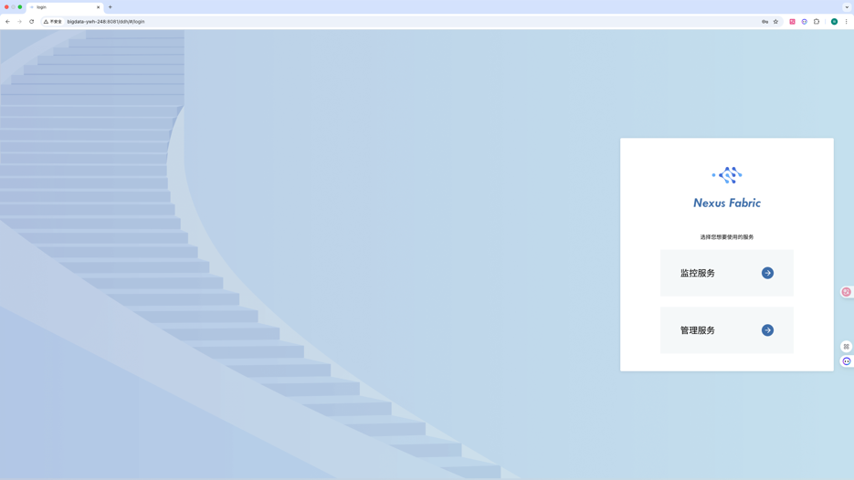

创建集群
   登录进入系统页面后在集群管理页面创建集群，NexusFabric支持多集群管理和授予用户集群管理员权限。
   
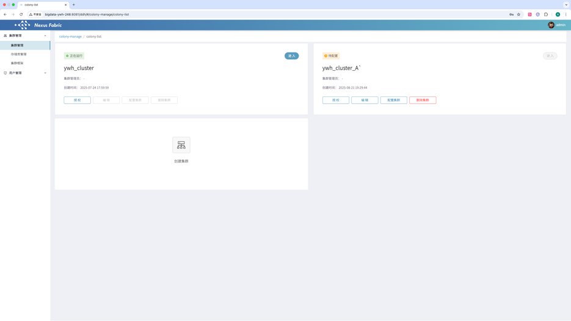
 
点击【创建集群】，输入集群名称，集群编码（集群唯一标识），集群框架。

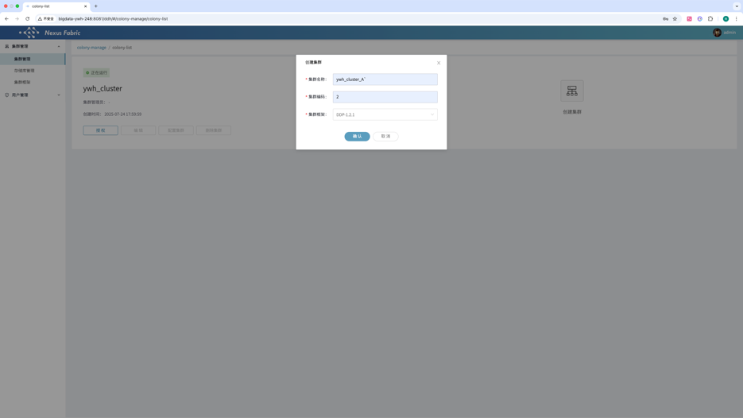

配置集群

创建成功后点击【配置集群】：

根据提示，输入主机列表（注意：主机名需与在准备环境中hostnamectl set-hostname 设置的主机名一致），ssh用户名默认为root和ssh端口默认为22。

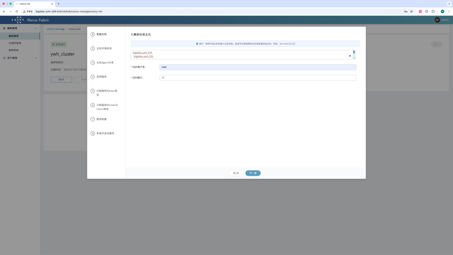

配置完成后，点击【下一步】，系统开始链接主机并进行主机环境校验。

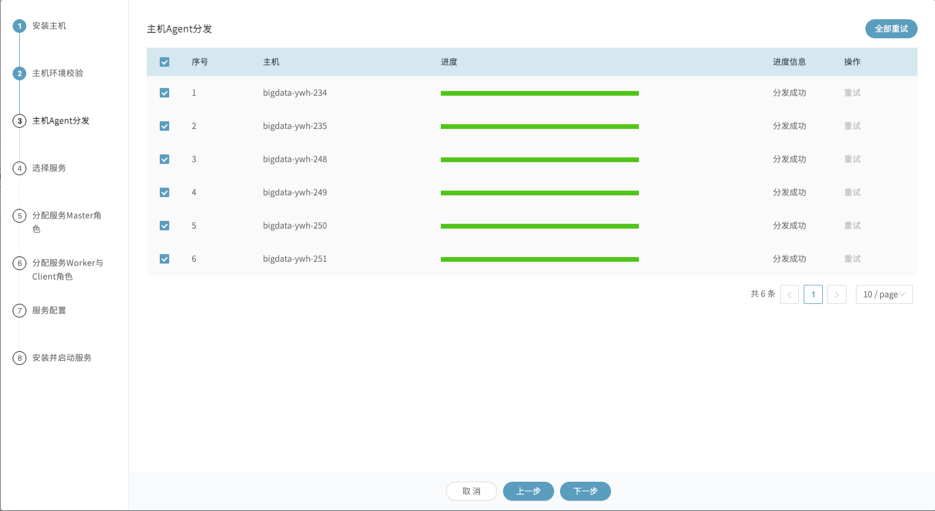

主机环境校验成功后点击【下一步】，主机agent分发步骤将自动分发datasophon-worker组件，并启动WorkerApplicationServer。主机管理Agent分发完成后，点击【下一步】，开始部署服务。

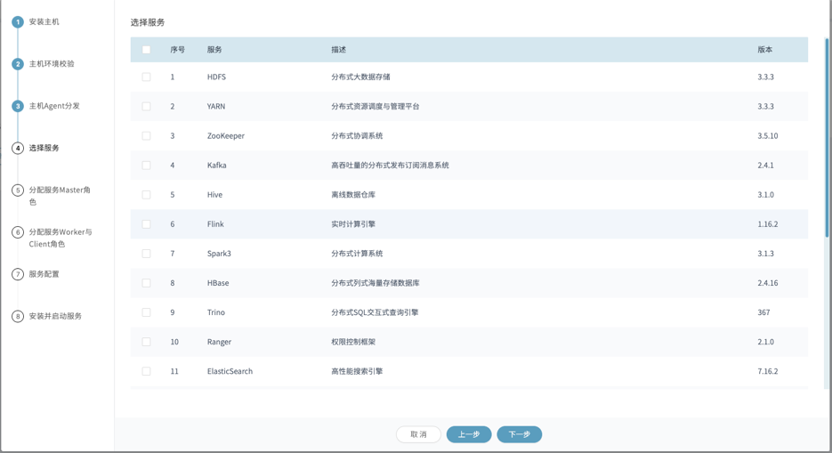

初始化配置集群先选择部署Prometheus、AlertManager、Grafana。NexusFabric依赖此三个组件实现系统监控告警管理。

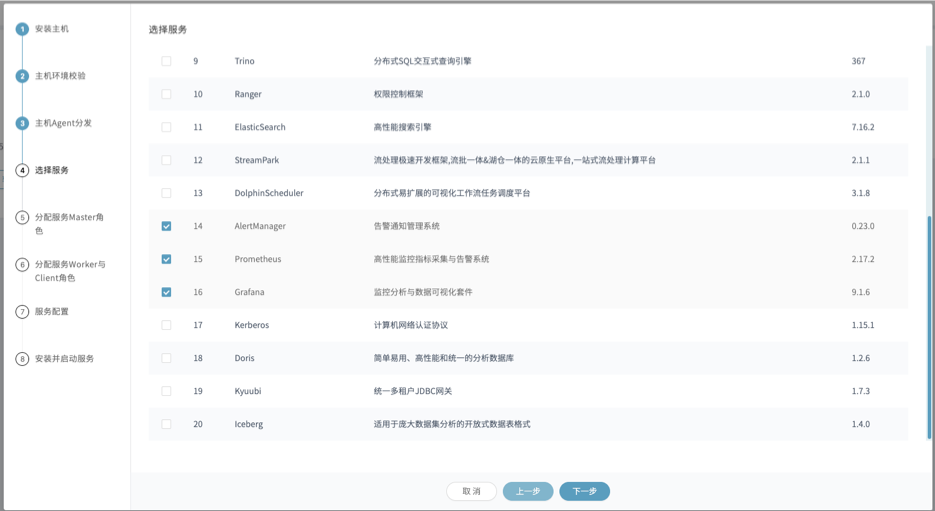

点击【下一步】，分配Prometheus、AlertManager、Grafana服务的master服务角色部署节点，此三个组件需部署在同一台机器上，修改各服务配置。系统已给出默认配置，大部分情况下无需修改。

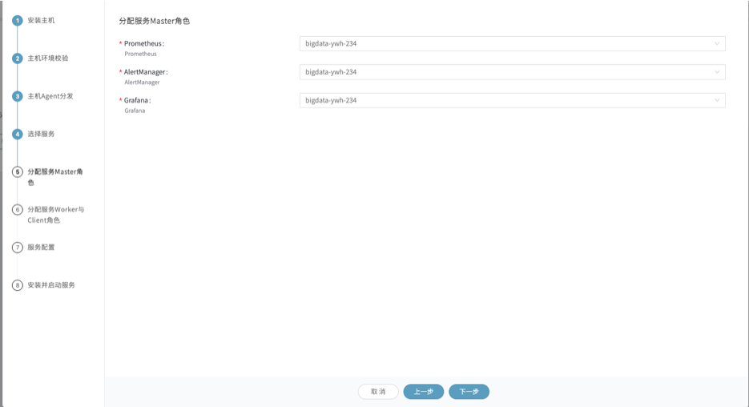

●ALERTMANAGER

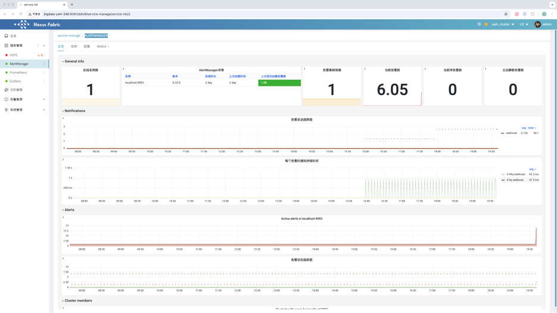

配置页面

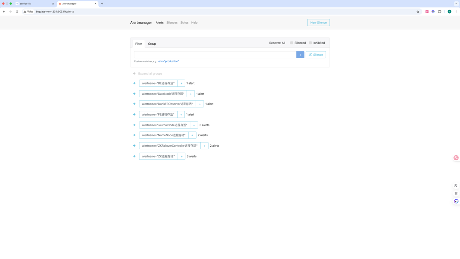

状态页

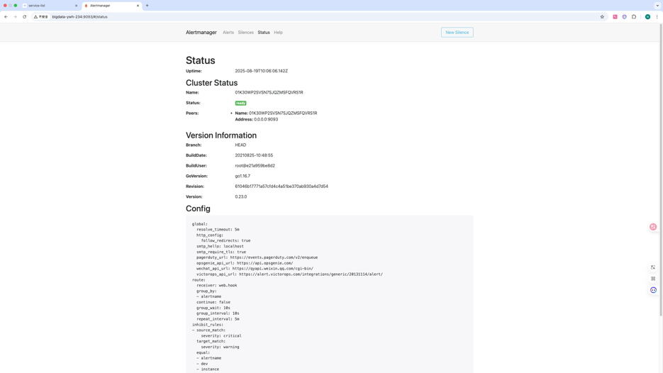

●Prometheus 总览

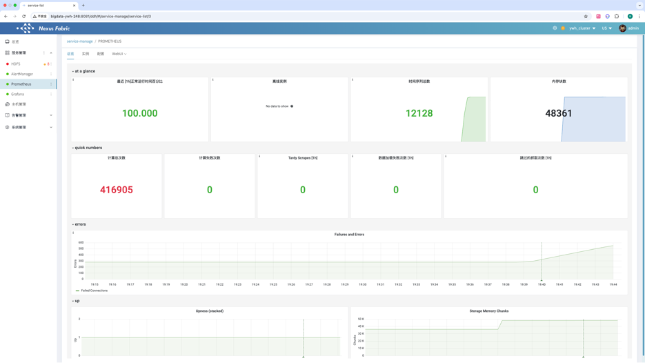

状态页

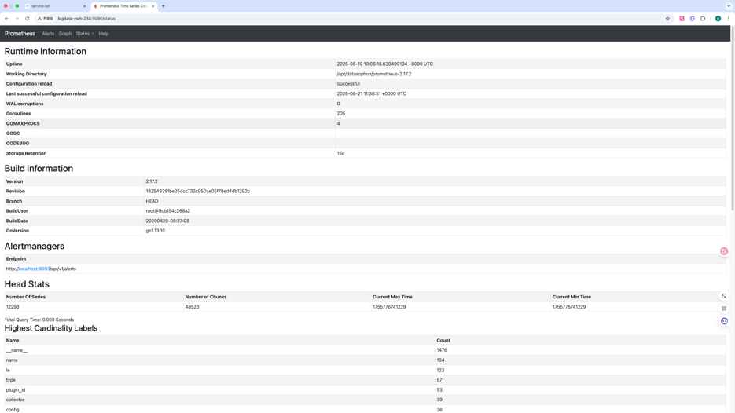

告警页

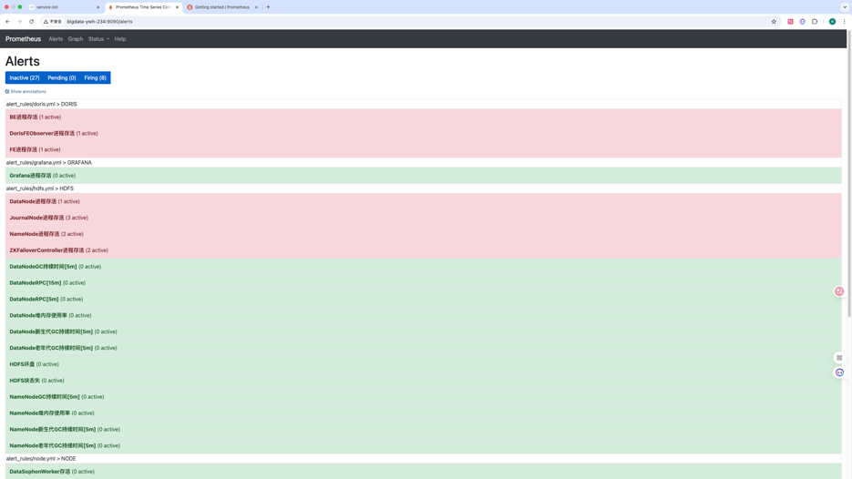

●Grafana 
概览页

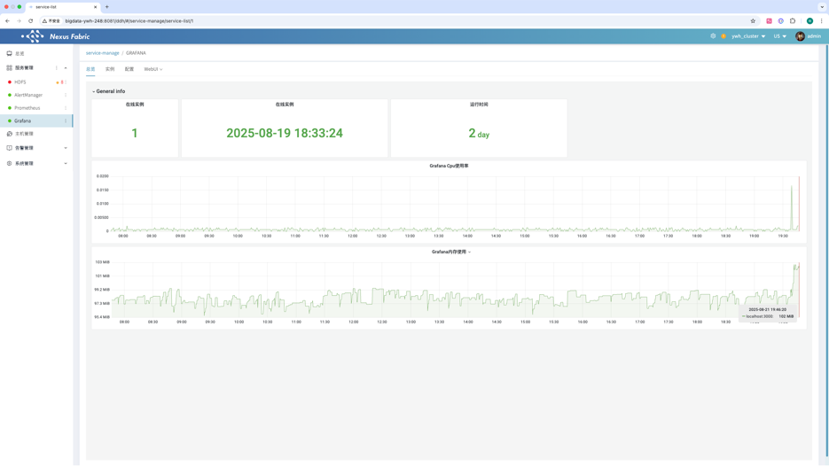

创建的监控页面

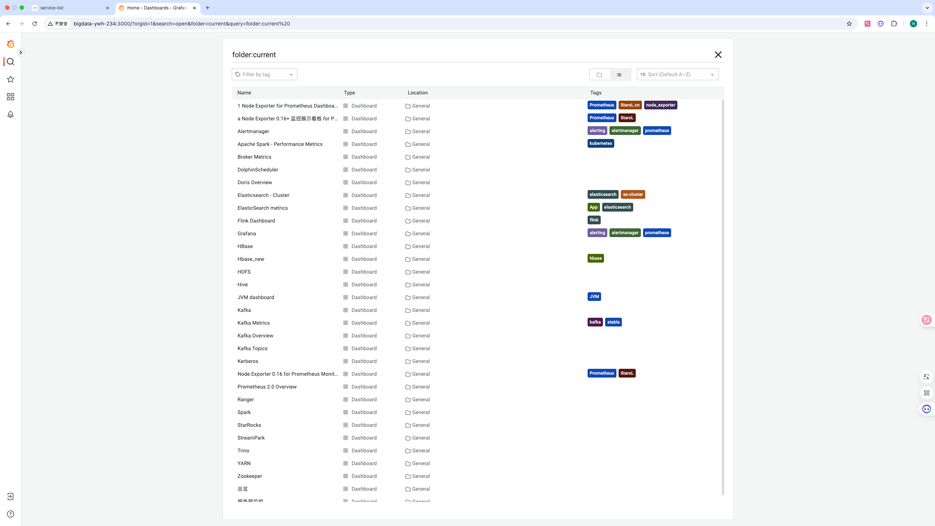

上述监控套件安装完之后，在集群管理页面点击【进入】，即可进入集群服务组件管理页面

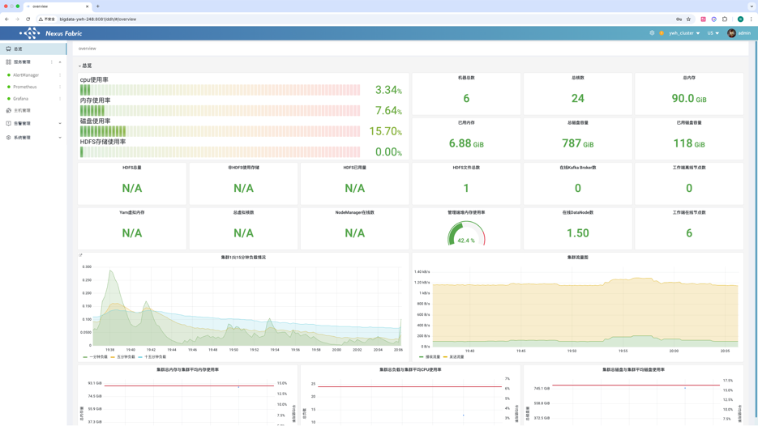
