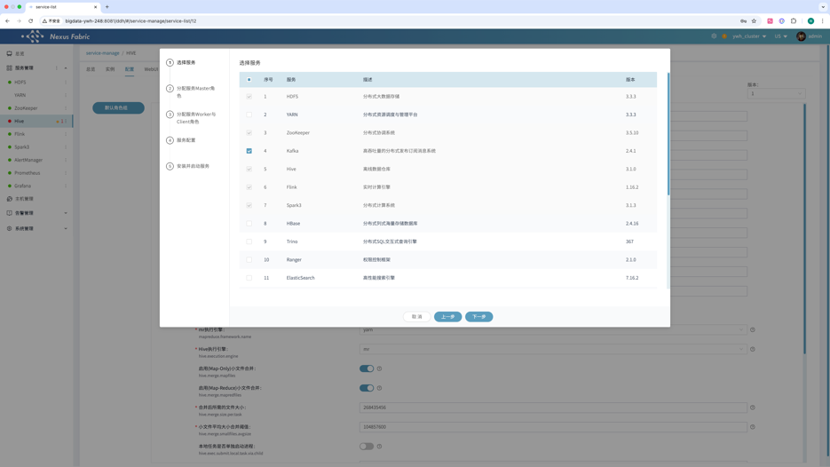
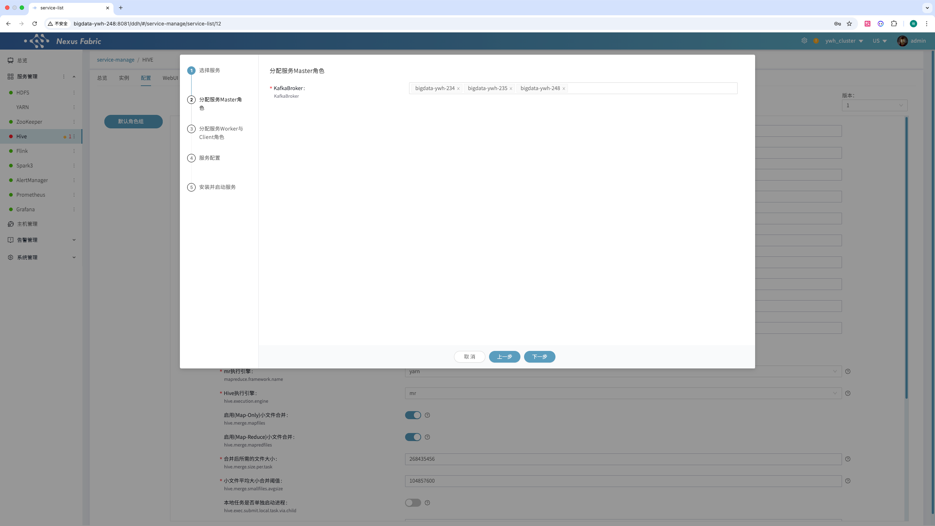
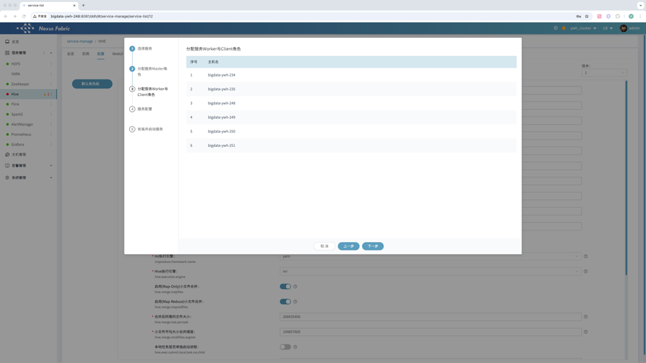
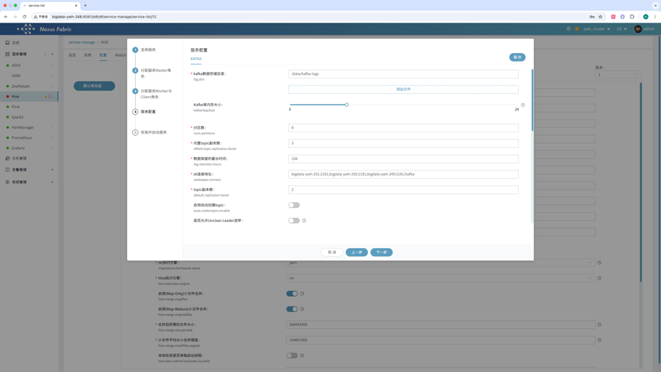
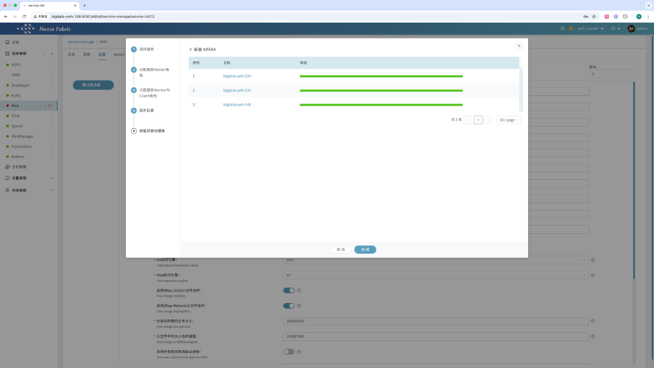
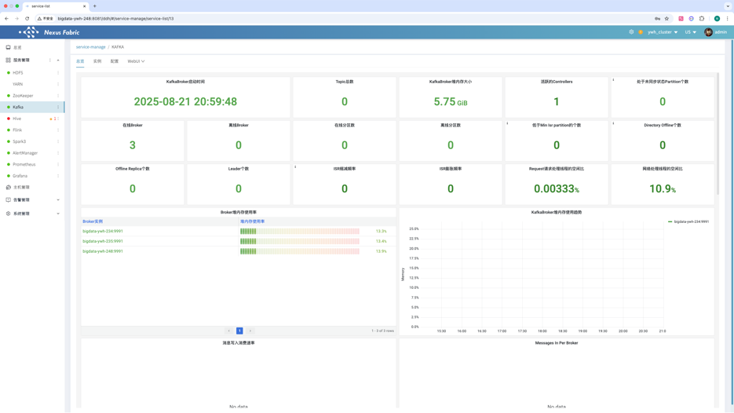
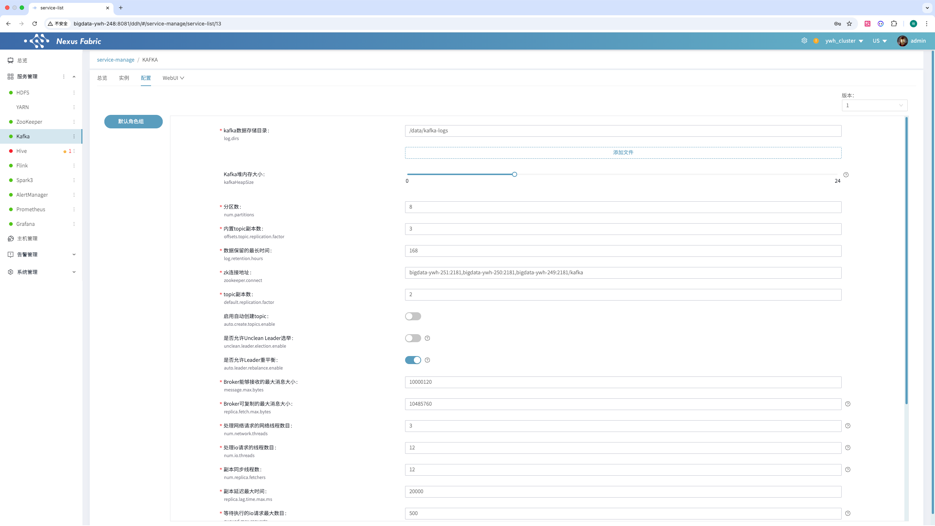

点击【服务管理】【添加服务】选择 Kafka

根据需要选择KafkaBroker位置

Kafka没有wokrer和client角色，直接跳过到下一步

在【服务配置】页面根据实际需要调整配置，因kafka依赖Zookeeper，所以安装kafka之前请先安装Zookeeper集群

点击【下一步】开始安装kafka集群

在【服务管理】点击kafka可查看服务总览

在【配置】页面可以根据实际需要调整kafka集群配置

