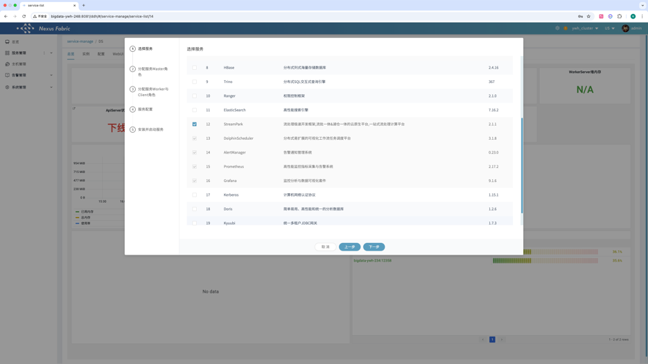
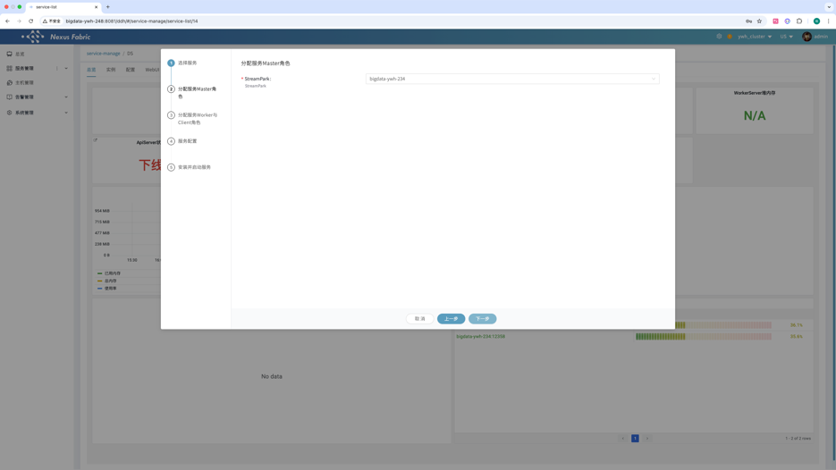
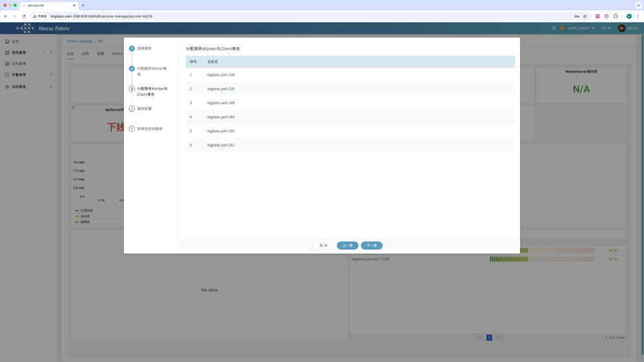
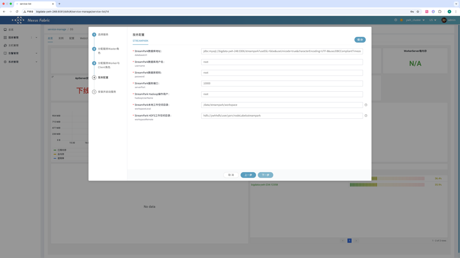
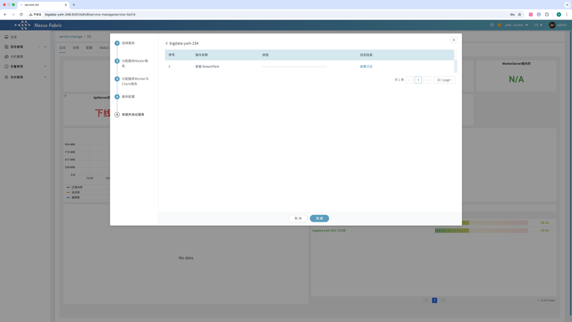
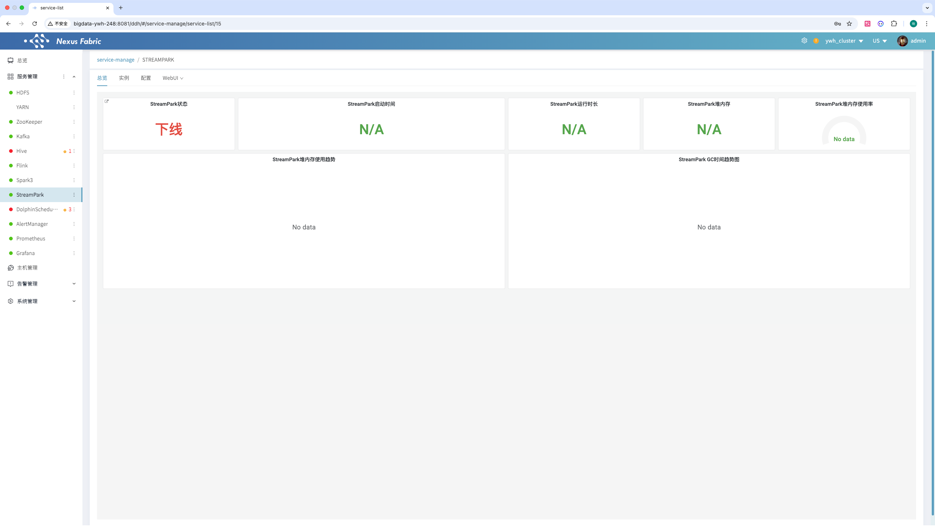

初始化StreamPark数据库

```
CREATE DATABASE streampark DEFAULT CHARACTER SET utf8 DEFAULT COLLATE utf8_general_ci;
GRANT ALL PRIVILEGES ON streampark.* TO 'streampark'@'%' IDENTIFIED BY 'streampark';
GRANT ALL PRIVILEGES ON streampark.* TO 'streampark'@'localhost' IDENTIFIED BY 'streampark';
flush privileges;
```

【服务管理】【添加服务】选择 StreamPark



分配Master角色



跳过worker与client角色 直接点击【下一步】



在【服务配置】页面，根据实际需求修改配置，重点注意创建mysql库时的服务器地址与用户名密码



点击【下一步】开始安装



安装完成之后在【服务管理】点击StreamPark查看总览


