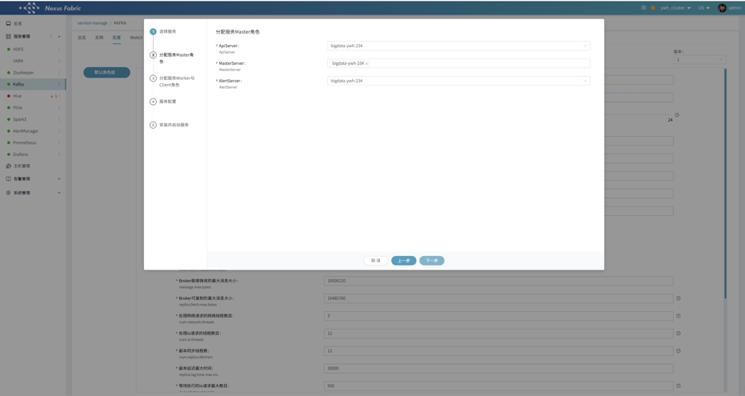
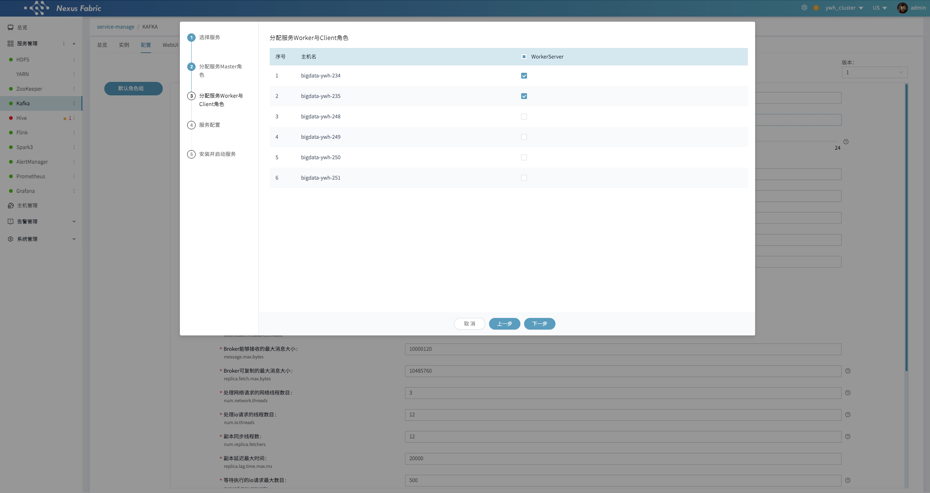
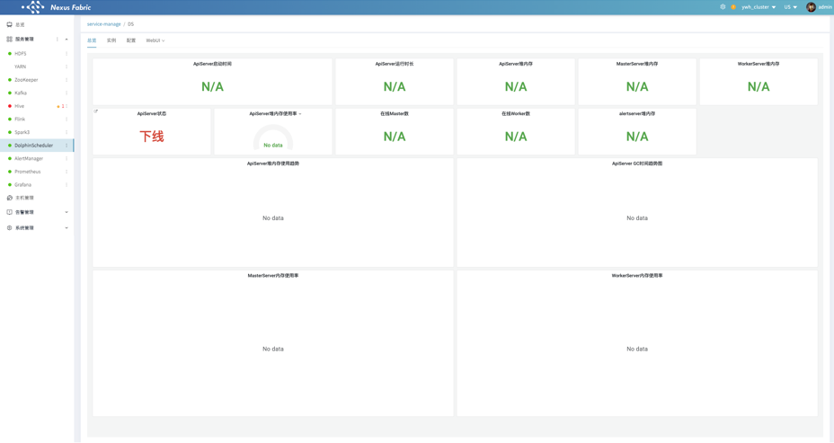

在mysql服务上初始化Dolphinscheduler所需数据库

```
CREATE DATABASE dolphinscheduler DEFAULT CHARACTER SET utf8 DEFAULT COLLATE utf8_general_ci;
GRANT ALL PRIVILEGES ON dolphinscheduler.* TO 'dolphinscheduler'@'%' IDENTIFIED BY 'dolphinscheduler';
GRANT ALL PRIVILEGES ON dolphinscheduler.* TO 'dolphinscheduler'@'localhost' IDENTIFIED BY 'dolphinscheduler';
flush privileges;
```

执行/opt/datasophon/DDP/packages目录下dolphinscheduler_mysql.sql创建dolphinscheduler数据库表。

【服务管理】【添加服务】选择DolphinScheduler


分配master角色



添加workerserver



在【服务配置】页面，修改配置，注意之前创建的mysql所在的服务器与用户名密码


开始安装


完成之后在【服务管理】中查看总览



在【配置】页面根据实际需要修改配置


